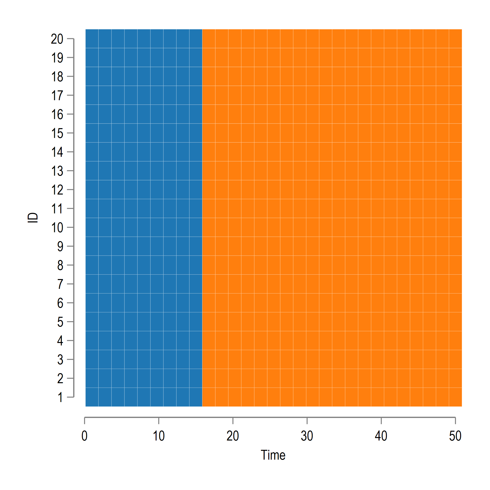
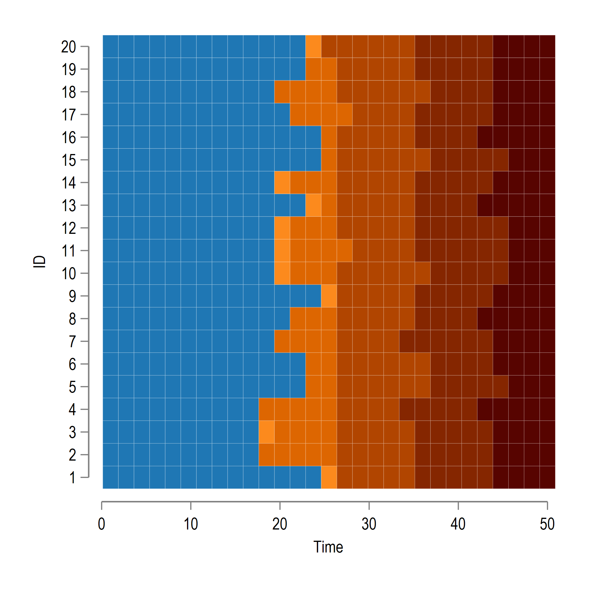

*Last updated: 07 September 2021*

# Notes

This repository tracks the recent developments in the Difference-in-Difference (DiD) literature. Currently, it is just a dump of my bookmarks from different websites including Twitter, GitHub, YouTube etc. This will be sorted out over time as the literature converges to some consensus. But this might still take a while.

This is a working document. If you want to report errors or contribute, just [open an issue](https://github.com/AsjadNaqvi/DiD/issues) on GitHub or e-mail at asjadnaqvi@gmail.com. Since paths and links are also subject to change, please report them to keep this repository as up-to-date as possible.

# Why do DiD?

TO BE ADDED...

## The classic DiD or the TWFE model

## Parallel trends

## Interventions

Treatments across different units can occur in various configurations. The figures below some of the most common treatment types. Here the x-axis represents the time scale, the y-axis the different groups (panel IDs) and the orange represents the time periods in which the units are treated. The figures below show types of differential treatment timings:

## Covariates

## The new DiD models

# Stata packages

Some package paths have been split across lines but adding spaces to keep table formatting intact. Just make sure they are in one line with spaces removed when copying them in Stata. To install packages from GitHub, get the `github` package: `net install github, from("https://haghish.github.io/github/")`.

| Name | Installation |  Package by | Reference paper |
| --- | --- | --- |   --- |
| `bacondecomp` | `ssc install bacondecomp, replace`    or    `net install ddtiming, from (https://tgoldring.com/code/)`  | [Andrew Goodman-Bacon](http://goodman-bacon.com/)     [Thomas Goldring](https://tgoldring.com/)    Austin Nichols  |   [Andrew Goodman-Bacon](http://goodman-bacon.com/)  (2021). [Difference-in-differences with variation in treatment timing](https://www.sciencedirect.com/science/article/abs/pii/S0304407621001445). Journal of Econometrics |
| `eventstudyinteract` | `ssc install eventstudyinteract, replace`  | [Liyang Sun](http://economics.mit.edu/grad/lsun20) |   [Liyang Sun](http://economics.mit.edu/grad/lsun20), [Sarah Abraham](https://www.cornerstone.com/Staff/Sarah-Abraham#) (2020). [Estimating dynamic treatment effects in event studies with heterogeneous treatment effects](https://www.sciencedirect.com/science/article/abs/pii/S030440762030378X). Journal of Econometrics. |
| `did_multiplegt` | `ssc install did_multiplegt, replace` |   [Clément de Chaisemartin](https://sites.google.com/site/clementdechaisemartin/)     [Xavier D'Haultfoeuille](https://faculty.crest.fr/xdhaultfoeuille/)  | Clément de Chaisemartin, Xavier D'Haultfoeuille (2020). [Two-Way Fixed Effects Estimators with Heterogeneous Treatment Effects](https://www.aeaweb.org/articles?id=10.1257/aer.20181169). American Economic Review.     Clément de Chaisemartin, Xavier D'Haultfoeuille (2021). [Two-way fixed effects regressions with several treatments](https://papers.ssrn.com/sol3/papers.cfm?abstract_id=3751060).      Clément de Chaisemartin, Xavier D'Haultfoeuille (2021). [Difference-in-Differences Estimators of Inter-temporal Treatment Effects](https://arxiv.org/abs/2007.04267). |
| `did_imputation` | `ssc install did_imputation, replace` |  [Kirill Borusyak](https://sites.google.com/view/borusyak/home)     [Xavier Jaravel](https://www.lse.ac.uk/economics/people/faculty/xavier-jaravel)     [Jann Spiess](https://www.gsb.stanford.edu/faculty-research/faculty/jann-spiess)   |   [Kirill Borusyak](https://sites.google.com/view/borusyak/home) , [Xavier Jaravel](https://www.lse.ac.uk/economics/people/faculty/xavier-jaravel) , [Jann Spiess](https://www.gsb.stanford.edu/faculty-research/faculty/jann-spiess)  (2021). [Revisiting Event Study Designs: Robust and Efficient Estimation](https://www.google.com/url?q=https%3A%2F%2Fwww.dropbox.com%2Fs%2Fy92mmyndlbkufo1%2FDraft_RobustAndEfficient.pdf%3Fraw%3D1&sa=D&sntz=1&usg=AFQjCNGGDRt4xPz3hCXhTWxchHJWh-1m_Q). |
| `drdid`   | `ssc install drdid, replace`    | [Fernando Rios-Avila](https://friosavila.github.io/playingwithstata/index.html)     [Pedro H.C. Sant'Anna](https://pedrohcgs.github.io/)     [Asjad Naqvi](https://github.com/asjadnaqvi)  |  [Pedro H.C. Sant'Anna](https://pedrohcgs.github.io/) , [Jun Zhao](https://www.junbeanzhao.com/) (2020). [Doubly robust difference-in-differences estimators](https://www.sciencedirect.com/science/article/abs/pii/S0304407620301901), Journal of Econometrics.  |
| `csdid`   |  `ssc install csdid, replace`    | [Fernando Rios-Avila](https://friosavila.github.io/playingwithstata/index.html)     [Pedro H.C. Sant'Anna](https://pedrohcgs.github.io/)    |  [Brantly Callaway](https://bcallaway11.github.io/), [Pedro H.C. Sant'Anna](https://pedrohcgs.github.io/)  (2020). [Difference-in-Differences with multiple time periods](https://www.sciencedirect.com/science/article/abs/pii/S0304407620303948), Journal of Econometrics.  |
| `flexpaneldid` | `ssc install flexpaneldid, replace`   | [Eva Dettmann](https://www.iwh-halle.de/en/about-the-iwh/team/detail/eva-dettmann/)    [Alexander Giebler](https://www.iwh-halle.de/ueber-das-iwh/team/detail/alexander-giebler/)    [Antje Weyh](https://www.iab.de/754/section.aspx/Mitarbeiter/359)   | [Eva Dettmann](https://www.iwh-halle.de/en/about-the-iwh/team/detail/eva-dettmann/), [Alexander Giebler](https://www.iwh-halle.de/ueber-das-iwh/team/detail/alexander-giebler/), [Antje Weyh](https://www.iab.de/754/section.aspx/Mitarbeiter/359) (2020). [Flexpaneldid: A Stata Toolbox for Causal Analysis with Varying Treatment Time and Duration](https://papers.ssrn.com/sol3/papers.cfm?abstract_id=3692458). IWH Discussion Papers No. 3/2020 |
| `xtevent` | `ssc install xtevent, replace`   | [Simon Freyaldenhoven](https://simonfreyaldenhoven.github.io/)    [Christian Hansen](https://voices.uchicago.edu/christianhansen/)    [Jorge Perez Perez](https://jorgeperezperez.com/)      [Jesse M. Shapiro](https://www.brown.edu/Research/Shapiro/)  | [Simon Freyaldenhoven](https://simonfreyaldenhoven.github.io/), [Christian Hansen](https://voices.uchicago.edu/christianhansen/), [Jesse M. Shapiro](https://www.brown.edu/Research/Shapiro/) (2019). [Pre-event Trends in the Panel Event-Study Design](https://www.aeaweb.org/articles?id=10.1257/aer.20180609). American Economic Review. |
| `did2s` |  `ssc install did2s, replace`     |  [Kyle Butts](https://kylebutts.com/)  | [John Gardner](https://jrgcmu.github.io/) (2021). [Two-stage differences in differences](https://jrgcmu.github.io/2sdd_current.pdf). |
| `stackedev` | `github install joshbleiberg/stackedev`    | [Joshua Bleiberg](https://sites.google.com/view/joshbleiberg)  | [Doruk Cengiz](https://dorukcengiz.netlify.app/) , [Arindrajit Dube](https://arindube.com/) , [Attila Lindner](https://sites.google.com/site/attilalindner/), [Ben Zipperer](https://www.epi.org/people/ben-zipperer/)  (2019). [The effect of minimum wages on low-wage jobs](https://academic.oup.com/qje/article/134/3/1405/5484905). The Quarterly Journal of Economics.    |
| `eventdd`  | `ssc install eventdd, replace` | Damian Clarke    Kathya Tapia | [Damian Clarke](http://www.damianclarke.net/), Kathya Tapia (2020). [Implementing the Panel Event Study](http://ftp.iza.org/dp13524.pdf). |
| `staggered_stata`  | `github install jonathandroth/staggered_stata`   | [Jonathan Roth](https://jonathandroth.github.io/)    | [Jonathan Roth](https://jonathandroth.github.io/) , [Pedro H.C. Sant'Anna](https://pedrohcgs.github.io/)  (2021). [Efficient Estimation for Staggered Rollout Designs](https://arxiv.org/pdf/2102.01291.pdf)    |

## How to use these packages?

For individual packages, check their helpfiles for example code.

For using and plotting multiple DiD packages in Stata, the `event_plot` command (`ssc install event_plot, replace`) by [Kirill Borusyak](https://sites.google.com/view/borusyak/home)  is highly recommended. It estimates and combines results from [five different estimators](https://github.com/borusyak/did_imputation/blob/main/five_estimators_example.png). Example of how to do event study plots using different packages is given in the [five_estimators_example.do](https://github.com/borusyak/did_imputation/blob/main/five_estimators_example.do) dofile on [GitHub](https://github.com/borusyak/did_imputation).

The `event_plot` usage example has been extended twice:

* [David Burgherr](https://www.lse.ac.uk/International-Inequalities/People/David-Burgherr)  has a dofile on [Dropbox](https://www.dropbox.com/s/p5i94ryf4h9o335/five_estimators_example_adapted.do?dl=0).

* [Pietro Santoleri](https://pietrosantoleri.github.io/)  has a dofile on [GitHub](https://github.com/pietrosantoleri/staggered_did) that plots [seven different estimators](https://github.com/pietrosantoleri/staggered_did/blob/main/output/seven_estimators_example_allt.png).

[Scott Cunningham](https://www.scunning.com/)  has sample dofiles as part of the [CodeChella](https://github.com/scunning1975/codechella) DiD event.

# R packages

Packages installation paths have been split across lines to preverse table formatting in Markdown.

| Name | Installation |  Package by | Reference paper |
| --- | --- | --- |   --- |
| `bacondecomp` | `install.packages` `("bacondecomp")`  | [Evan Flack](https://github.com/evanjflack)    [Ed Jee](https://edjeeongithub.github.io/)  |   [Andrew Goodman-Bacon](http://goodman-bacon.com/) (2021). [Difference-in-differences with variation in treatment timing](https://www.sciencedirect.com/science/article/abs/pii/S0304407621001445). Journal of Econometrics. |
| `fixest` with `sunab()` function | `install.packages` `("fixest")` | [Laurent Bergé](https://sites.google.com/site/laurentrberge/) | [Liyang Sun](http://economics.mit.edu/grad/lsun20), [Sarah Abraham](https://www.cornerstone.com/Staff/Sarah-Abraham#) (2020). [Estimating dynamic treatment effects in event studies with heterogeneous treatment effects](https://www.sciencedirect.com/science/article/abs/pii/S030440762030378X). Journal of Econometrics. |
| `TwoWayFEWeights` | `install.packages` `("TwoWayFEWeights")` | [Shuo Zhang](https://github.com/shuo-zhang-ucsb) | Clément de Chaisemartin, Xavier D'Haultfoeuille (2021). [Two-Way Fixed Effects Estimators with Heterogeneous Treatment Effects](https://www.aeaweb.org/articles?id=10.1257/aer.20181169). |
| `DIDmultiplegt` [not as recent as Stata version] | `install.packages` `("DIDmultiplegt")` | [Shuo Zhang](https://github.com/shuo-zhang-ucsb) | Clément de Chaisemartin, Xavier D'Haultfoeuille (2020). [Two-Way Fixed Effects Estimators with Heterogeneous Treatment Effects](https://www.aeaweb.org/articles?id=10.1257/aer.20181169). American Economic Review. |
| `drdid`   |  `devtools::install_github` `("pedrohcgs/DRDID")`   |  [Pedro H.C. Sant'Anna](https://pedrohcgs.github.io/)     [Jun Zhao](https://www.junbeanzhao.com/) | [Pedro H.C. Sant'Anna](https://pedrohcgs.github.io/) , [Jun Zhao](https://www.junbeanzhao.com/) (2020). [Doubly robust difference-in-differences estimators](https://www.sciencedirect.com/science/article/abs/pii/S0304407620301901), Journal of Econometrics.  |
| `did`   |   `install.packages("did")`   | [Pedro H.C. Sant'Anna](https://pedrohcgs.github.io/)      [Brantly Callaway](https://bcallaway11.github.io/) |  [Brantly Callaway](https://bcallaway11.github.io/), [Pedro H.C. Sant'Anna](https://pedrohcgs.github.io/)  (2020). [Difference-in-Differences with multiple time periods](https://www.sciencedirect.com/science/article/abs/pii/S0304407620303948), Journal of Econometrics.  |
|	`staggered`	|	`devtools::install_github` `("jonathandroth/staggered")`		|	[Jonathan Roth](https://jonathandroth.github.io/)      [Pedro H.C. Sant'Anna](https://pedrohcgs.github.io/)   |	[Jonathan Roth](https://jonathandroth.github.io/) , [Pedro H.C. Sant'Anna](https://pedrohcgs.github.io/)  (2021). [Efficient Estimation for Staggered Rollout Designs](https://arxiv.org/pdf/2102.01291.pdf)	|
| `didimputation`    | `devtools::install_github` `("kylebutts/didimputation")`    | [Kyle Butts](https://kylebutts.com/)      |  [Kirill Borusyak](https://sites.google.com/view/borusyak/home) , [Xavier Jaravel](https://www.lse.ac.uk/economics/people/faculty/xavier-jaravel) , [Jann Spiess](https://www.gsb.stanford.edu/faculty-research/faculty/jann-spiess)  (2021). [Revisiting Event Study Designs: Robust and Efficient Estimation](https://www.google.com/url?q=https%3A%2F%2Fwww.dropbox.com%2Fs%2Fy92mmyndlbkufo1%2FDraft_RobustAndEfficient.pdf%3Fraw%3D1&sa=D&sntz=1&usg=AFQjCNGGDRt4xPz3hCXhTWxchHJWh-1m_Q).        |
| `did2s` |  `devtools::install_github` `("kylebutts/did2s")`     |  [Kyle Butts](https://kylebutts.com/)  | [John Gardner](https://jrgcmu.github.io/) (2021). [Two-stage differences in differences](https://jrgcmu.github.io/2sdd_current.pdf).    [Kirill Borusyak](https://sites.google.com/view/borusyak/home) , [Xavier Jaravel](https://www.lse.ac.uk/economics/people/faculty/xavier-jaravel) , [Jann Spiess](https://www.gsb.stanford.edu/faculty-research/faculty/jann-spiess)  (2021). [Revisiting Event Study Designs: Robust and Efficient Estimation](https://www.google.com/url?q=https%3A%2F%2Fwww.dropbox.com%2Fs%2Fy92mmyndlbkufo1%2FDraft_RobustAndEfficient.pdf%3Fraw%3D1&sa=D&sntz=1&usg=AFQjCNGGDRt4xPz3hCXhTWxchHJWh-1m_Q)    Liyang Sun, Sarah Abraham (2020). [Estimating dynamic treatment effects in event studies with heterogeneous treatment effects](https://www.sciencedirect.com/science/article/abs/pii/S030440762030378X). Journal of Econometrics.    Brantly Callaway, [Pedro H.C. Sant'Anna](https://pedrohcgs.github.io/)  (2020). [Difference-in-Differences with multiple time periods](https://www.sciencedirect.com/science/article/abs/pii/S0304407620303948), Journal of Econometrics.    [Jonathan Roth](https://jonathandroth.github.io/) , [Pedro H.C. Sant'Anna](https://pedrohcgs.github.io/)  (2021). [Efficient Estimation for Staggered Rollout Designs](https://arxiv.org/pdf/2102.01291.pdf). |
| `HonestDiD`   | `remotes::install_github` `("asheshrambachan/HonestDiD")`  | [Ashesh Rambachan](https://asheshrambachan.github.io/)     [Jonathan Roth](https://jonathandroth.github.io/)      | [Ashesh Rambachan](https://asheshrambachan.github.io/) , [Jonathan Roth](https://jonathandroth.github.io/)  (2021). [An Honest Approach to Parallel Trends](https://asheshrambachan.github.io/assets/files/hpt-draft.pdf).         |

# Julia packages

This is still being updated. See links below for details. There is also a [Julia DiffinDiff](https://github.com/JuliaDiffinDiffs) group on GitHub which contains various packages.

| Name | Installation |  Package by | Reference paper |
| --- | --- | --- |   --- |
| InteractionWeightedDIDs.jl  | [GitHub](https://github.com/JuliaDiffinDiffs/InteractionWeightedDIDs.jl)   |    |    |
| SynthControl.jl  | [GitHub](https://github.com/nilshg/SynthControl.jl)   |    |    |

# Literature

## Papers

Papers are in alphabetical order by last name. Papers without journals are pre-prints. Please click on paper links for details. SORTABLE TABLE TO BE ADDED.

Dmitry Arkhangelsky, Susan Athey, David A. Hirshberg, Guido W. Imbens, Stefan Wager (2021). [Synthetic Difference in Differences](https://www.aeaweb.org/articles?id=10.1257/aer.20190159). American Economic Review.

[Dmitry Arkhangelsky](https://sites.google.com/view/dmitry-arkhangelsky/home) , [Guido Imbens](https://www.gsb.stanford.edu/faculty-research/faculty/guido-w-imbens), [Lihua Lei](https://lihualei71.github.io/) , [Xiaoman Luo](https://xiaomanluo.github.io/) (2021). [Double-Robust Two-Way-Fixed-Effects Regression For Panel Data](https://arxiv.org/abs/2107.13737).

Susan Athey, Guido Imbens (2006). [Identification and inference in nonlinear difference-indifferences models](https://onlinelibrary.wiley.com/doi/abs/10.1111/j.1468-0262.2006.00668.x). Econometrica.

Andrew Baker, David F. Larcker, Charles C. Y. Wang (2021). [How Much Should We Trust Staggered Difference-In-Differences Estimates?](https://papers.ssrn.com/sol3/papers.cfm?abstract_id=3794018)

[Kirill Borusyak](https://sites.google.com/view/borusyak/home) , [Xavier Jaravel](https://www.lse.ac.uk/economics/people/faculty/xavier-jaravel) , [Jann Spiess](https://www.gsb.stanford.edu/faculty-research/faculty/jann-spiess)  (2021). [Revisiting Event Study Designs: Robust and Efficient Estimation](https://www.google.com/url?q=https%3A%2F%2Fwww.dropbox.com%2Fs%2Fy92mmyndlbkufo1%2FDraft_RobustAndEfficient.pdf%3Fraw%3D1&sa=D&sntz=1&usg=AFQjCNGGDRt4xPz3hCXhTWxchHJWh-1m_Q).

Brantly Callaway, Andrew Goodman-Bacon, Pedro H.C. Sant'Anna (2021). [Difference-in-Differences with a Continuous Treatment](https://arxiv.org/pdf/2107.02637.pdf).

Brantly Callaway, Pedro H.C. Sant'Anna (2020). [Difference-in-Differences with multiple time periods](https://www.sciencedirect.com/science/article/abs/pii/S0304407620303948), Journal of Econometrics.

Clément de Chaisemartin, Xavier D'Haultfoeuille (2018). [Fuzzy differences-in-differences](https://academic.oup.com/restud/article-abstract/85/2/999/4096388). The Review of Economic Studies.

Clément de Chaisemartin, Xavier D'Haultfoeuille (2020). [Two-Way Fixed Effects Estimators with Heterogeneous Treatment Effects](https://www.aeaweb.org/articles?id=10.1257/aer.20181169). American Economic Review.

Clément de Chaisemartin, Xavier D'Haultfoeuille (2021). [Two-way fixed effects regressions with several treatments](https://papers.ssrn.com/sol3/papers.cfm?abstract_id=3751060).

Clément de Chaisemartin, Xavier D'Haultfoeuille (2021). [Difference-in-Differences Estimators of Inter-temporal Treatment Effects](https://arxiv.org/abs/2007.04267).

Xavier D’Haultfoeuille, Stefan Hoderlein, Yuya Sasaki (2013). [Nonlinear difference-indifferences in repeated cross sections with continuous treatments](https://www.econstor.eu/bitstream/10419/97404/1/766176037.pdf).

Xavier D’Haultfoeuille, Stefan Hoderlein, Yuya Sasaki (2021). [Nonparametric Difference-in-Differences in Repeated Cross-Sections with Continuous Treatments](https://arxiv.org/abs/2104.14458).

[Bruno Ferman](https://sites.google.com/site/brunoferman/) , Cristine Pinto (2021). [Synthetic Controls with Imperfect Pre-Treatment Fit](https://qeconomics.org/ojs/forth/1596/1596-3.pdf). Quantitative Economics.

[Simon Freyaldenhoven](https://simonfreyaldenhoven.github.io/), [Christian Hansen](https://www.chicagobooth.edu/faculty/directory/h/christian-b-hansen), [Jesse M. Shapiro](https://www.brown.edu/Research/Shapiro/) (2019). [Pre-event Trends in the Panel Event-Study Design](https://www.aeaweb.org/articles?id=10.1257/aer.20180609). American Economic Review.

Hans Fricke (2017). [Identification based on difference-in-differences approaches with multiple treatments](https://onlinelibrary.wiley.com/doi/abs/10.1111/obes.12178). Oxford Bulletin of Economics and Statistics.

Pamela Jakiela (2021). [Simple Diagnostics for Two-Way Fixed Effects](https://arxiv.org/abs/2103.13229)

[John Gardner](https://jrgcmu.github.io/) (2021). [Two-stage differences in differences](https://jrgcmu.github.io/2sdd_current.pdf).

[Andrew Goodman-Bacon](http://goodman-bacon.com/) (2021). [Difference-in-differences with variation in treatment timing](https://www.sciencedirect.com/science/article/abs/pii/S0304407621001445). Journal of Econometrics.

[Jonathan Roth](https://jonathandroth.github.io/)  (2021). [Pre-test with Caution: Event-study Estimates After Testing for Parallel Trends](https://jonathandroth.github.io/assets/files/roth_pretrends_testing.pdf).

[Jonathan Roth](https://jonathandroth.github.io/) , [Pedro H.C. Sant'Anna](https://pedrohcgs.github.io/)  (2021). [Efficient Estimation for Staggered Rollout Designs](https://arxiv.org/pdf/2102.01291.pdf).

[Pedro H.C. Sant'Anna](https://pedrohcgs.github.io/) , [Jun Zhao](https://www.junbeanzhao.com/) (2020). [Doubly robust difference-in-differences estimators](https://www.sciencedirect.com/science/article/abs/pii/S0304407620301901), Journal of Econometrics.

[Liyang Sun](http://economics.mit.edu/grad/lsun20), [Sarah Abraham](https://www.cornerstone.com/Staff/Sarah-Abraham#) (2020). [Estimating dynamic treatment effects in event studies with heterogeneous treatment effects](https://www.sciencedirect.com/science/article/abs/pii/S030440762030378X). Journal of Econometrics.

## Books
The books below are the ones that discuss the new DiD literature. There are of course many other great books!

[Scott Cunningham](https://www.scunning.com/)  (2020). [Causal Inference: The Mix Tape](https://mixtape.scunning.com/).

[Nick Huntington-Klein](https://nickchk.com/)  (2021). [The Effect](https://theeffectbook.net/).

# DiD knowledge curation

Here are people who are actively involved in curating information on the latest DiD developments. This includes blogs, lecture series, tweets.

## Events and Videos

<!---
[Pedro H.C. Sant'Anna](https://pedrohcgs.github.io/) . [Seminar on DiD](https://statisticalhorizons.com/seminars/public-seminars/difference-in-differences) on **24-27 August, 2021** organized by [Statistical Horizons](https://statisticalhorizons.com/)  is now open for registeration. --->

[Scott Cunningham](https://www.scunning.com/) : [CodeChella](https://causalinf.substack.com/p/codechella-announcement) the ultimate DiD event **Workshop 1: Friday July 16th, 2021** and **Workshop 2: Friday July 23, 2021** which will be live on [Twitch](https://www.twitch.tv/causalinf_did). The videos from the workshop are now up on [YouTube](https://www.youtube.com/user/scunning/videos).

[Chloe East](https://www.chloeneast.com/)  organizes an online [DiD reading group](https://www.chloeneast.com/metrics-discussions.html).

[Taylor J. Wright](https://taylorjwright.github.io/)  organizes an online [DiD reading group](https://taylorjwright.github.io/did-reading-group/). The lectures can be viewed on [YouTube](https://www.youtube.com/channel/UCA7Idy0MfpP-uAjOebsFVuA/videos). Here is a playlist in the order they appear:

* Andrew Goodman-Bacon: [Difference-in-Differences with Variation in Treatment Timing](https://www.youtube.com/watch?v=m1xSMNTKoMs&list=PLVObvb_htcuBt8mV9yNagt7hK9FL5KXeE). *27 April 2021*.
* Jonathan Roth: [Testing and Sensitivity Analysis for Parallel Trends](https://www.youtube.com/watch?v=F8C1xaPoRvM&list=PLVObvb_htcuBt8mV9yNagt7hK9FL5KXeE&index=2). *10 May 2021*.
* Pedro H.C. Sant'Anna: [Difference-in-Differences with Multiple Time Periods](https://www.youtube.com/watch?v=VLviaylakAo&list=PLVObvb_htcuBt8mV9yNagt7hK9FL5KXeE&index=3). *15 May 2021*.
* Akash Issar: [Two-way fixed effects estimators with heterogeneous treatment effects](https://www.youtube.com/watch?v=xA8dmXfucoE&list=PLVObvb_htcuBt8mV9yNagt7hK9FL5KXeE&index=4). *11 June 2021*.
* Kirill Borusyak: [Revisiting Event Study Designs: Robust and Efficient Estimation](https://www.youtube.com/watch?v=rdfTxWnudt4&list=PLVObvb_htcuBt8mV9yNagt7hK9FL5KXeE&index=5). *13 June 2021*.
* Kyle Butts: [Difference-in-Differences with Spatial Spillovers](https://www.youtube.com/watch?v=nZrsaqG9FI4&list=PLVObvb_htcuBt8mV9yNagt7hK9FL5KXeE&index=6). *29 June 2021*.
* John Gardner: [Two-stage differences in differences](https://www.youtube.com/watch?v=6mVfQkmpghY&list=PLVObvb_htcuBt8mV9yNagt7hK9FL5KXeE&index=7). *11 July 2021*.
* Brantly Callaway: [Difference-in-Differences with a Continuous Treatment](https://www.youtube.com/watch?v=mbEJuCFCgXo&list=PLVObvb_htcuBt8mV9yNagt7hK9FL5KXeE&index=8). *6 August 2021*.
* Clément de Chaisemartin: [Two-way Fixed Effects Regressions with Several Treatments](https://www.youtube.com/watch?v=UHeJoc27qEM&list=PLVObvb_htcuBt8mV9yNagt7hK9FL5KXeE&index=9). *4 September 2021*.

## Blogs & notes
[Scott Cunningham](https://www.scunning.com/) : Scott's [Substack](https://causalinf.substack.com/) is the goto place for an easy-to-digest explanation of the latest metric-heavy DiD papers.

An [Introduction to DiD with Multiple Time Periods](https://cran.r-project.org/web/packages/did/vignettes/multi-period-did.html) by [Brantly Callaway](https://bcallaway11.github.io/) and [Pedro H.C. Sant'Anna](https://pedrohcgs.github.io/) .

Jeffrey Wooldridge  has made several notes on DiD which are shared on his [Dropbox](https://www.dropbox.com/sh/zj91darudf2fica/AADj_jaf5ZuS1muobgsnxS6Za?dl=0) including Stata dofiles.

[Fernando Rios-Avila](https://friosavila.github.io/playingwithstata/index.html)  has a great explainer for the Callaway and Sant'Anna (2020) CS-DID logic on his [blog](https://friosavila.github.io/playingwithstata/main_csdid.html).

[Christine Cai](https://christinecai.github.io/)  has a [working document](https://christinecai.github.io/PublicGoods/applied_micro_methods.pdf) which lists recent papers using different methods including DiDs.

[Andrew C. Baker](https://andrewcbaker.netlify.app/)  has notes on [Difference-in-Differences Methodology](https://andrewcbaker.netlify.app/2019/09/25/difference-in-differences-methodology/) with supporting material on [GitHub](https://github.com/andrewchbaker).

[Paul Goldsmith-Pinkham](https://paulgp.github.io/)  has a brilliant set of [lectures on empirical methods including DiD on GitHub](https://github.com/paulgp/applied-methods-phd). These are also supplemented by [YouTube videos](https://www.youtube.com/playlist?list=PLWWcL1M3lLlojLTSVf2gGYQ_9TlPyPbiJ).

## Interactive dashboards
These (related) interactive R-Shiny dashboards showcase how TWFE models give wrong estimates.

[Kyle Butts](https://kylebutts.com/) : https://kyle-butts.shinyapps.io/did_twfe/

[Hans Henrik Sievertsen](https://hhsievertsen.github.io/) : https://hhsievertsen.shinyapps.io/kylebutts_did_eventstudy/

## Tweets

Some interesting Twitter threads in no particular sequence. In order to render these properly, you need to view them on the [Jekyll website](https://asjadnaqvi.github.io/DiD/).

 

<blockquote class="twitter-tweet">
Hi <a href="https://twitter.com/pedrohcgs?ref_src=twsrc%5Etfw">@pedrohcgs</a> I have a question about <a href="https://twitter.com/jmwooldridge?ref_src=twsrc%5Etfw">@jmwooldridge</a> two way mundlak paper, &quot;As the number of pre-treatment periods increases, POLS will become even more efficient compared with CS (2021)&quot; Why your estimation is more less efficient? I&#39;m a few confused, sorry  All the best. Thks
&mdash; Oscar Andres Martinez (@oscand_martinez) <a href="https://twitter.com/oscand_martinez/status/1429915875369443341?ref_src=twsrc%5Etfw">August 23, 2021</a></blockquote> 

 

<blockquote class="twitter-tweet">
The diff-in-diff literature is plagued with the notion that more controls are always better (as long as the treatment effect has 2 stars). Someone please write a version of this <a href="https://twitter.com/yudapearl?ref_src=twsrc%5Etfw">@yudapearl</a> paper aimed at the assumptions &amp; examples of DiD. <a href="https://twitter.com/hashtag/EconTwitter?src=hash&amp;ref_src=twsrc%5Etfw">#EconTwitter</a> <a href="https://t.co/JfxQHGlxgw">https://t.co/JfxQHGlxgw</a>
&mdash; Arthur Lewbel (@lewbel) <a href="https://twitter.com/lewbel/status/1420725923922468866?ref_src=twsrc%5Etfw">July 29, 2021</a></blockquote> 

 

<blockquote class="twitter-tweet">
🚨Hello <a href="https://twitter.com/hashtag/EconTwitter?src=hash&amp;ref_src=twsrc%5Etfw">#EconTwitter</a>! I am very happy that my paper with Brantly Callaway, &quot;Difference-in-Differences with multiple time periods&quot;, is now forthcoming at the Journal of Econometrics. <a href="https://t.co/zoNxNY9ugq">https://t.co/zoNxNY9ugq</a>  What are the main take aways? I will ask my daughter to help me out.  1/n <a href="https://t.co/DNj3Cpxxlu">pic.twitter.com/DNj3Cpxxlu</a>
&mdash; Pedro H. C. Sant&#39;Anna (@pedrohcgs) <a href="https://twitter.com/pedrohcgs/status/1340006487456964608?ref_src=twsrc%5Etfw">December 18, 2020</a></blockquote> 

 

<blockquote class="twitter-tweet">
I finally got my TWFE/Mundlak/DID paper in good enough shape to make it an official working paper. I&#39;ll put it in other places but it&#39;s currently here:<a href="https://t.co/D4iQETUSlX">https://t.co/D4iQETUSlX</a>  Also, the Stata stuff is still with the Dropbox link:<a href="https://t.co/q1AnkhEF97">https://t.co/q1AnkhEF97</a><a href="https://twitter.com/hashtag/metricstotheface?src=hash&amp;ref_src=twsrc%5Etfw">#metricstotheface</a>
&mdash; Jeffrey Wooldridge (@jmwooldridge) <a href="https://twitter.com/jmwooldridge/status/1427472491367305219?ref_src=twsrc%5Etfw">August 17, 2021</a></blockquote> 

 

<blockquote class="twitter-tweet">
In preparing a DID course, I discovered some other neat stuff. When you impose PT and allow flexible interactions with covariates the way I do, the POLS estimator is numerically identical to the comparable imputation estimator in Borusyak, Jaravel, Spiess (2021). <a href="https://twitter.com/borusyak?ref_src=twsrc%5Etfw">@borusyak</a>
&mdash; Jeffrey Wooldridge (@jmwooldridge) <a href="https://twitter.com/jmwooldridge/status/1427472503467872259?ref_src=twsrc%5Etfw">August 17, 2021</a></blockquote> 

 

<blockquote class="twitter-tweet">
More DID stuff, re: parallel trends. If you have two pre-treatment periods there are various equiv ways to test for pre-trends. Here are three (no controls): 1. Regress cy2 = y2 - y1 on 1, d using t = 2; obtain t test on d. This is a standard placebo test.<a href="https://twitter.com/hashtag/metricstotheface?src=hash&amp;ref_src=twsrc%5Etfw">#metricstotheface</a>
&mdash; Jeffrey Wooldridge (@jmwooldridge) <a href="https://twitter.com/jmwooldridge/status/1428101550539517963?ref_src=twsrc%5Etfw">August 18, 2021</a></blockquote> 

 

<blockquote class="twitter-tweet">
In my career I have spent a lot of time assessing parallel trends in dif-in-dif models and visualizing those; this one is on top of my current list... and developing this was a team effort!  Show placebo estimates for a whole set of placebo dates, each w dynamic treatment effects <a href="https://t.co/lxSfekefkY">https://t.co/lxSfekefkY</a>
&mdash; Arindrajit Dube (@arindube) <a href="https://twitter.com/arindube/status/1428814968040865795?ref_src=twsrc%5Etfw">August 20, 2021</a></blockquote> 

 

<blockquote class="twitter-tweet">
I spent this past week catching up with the DiD literature. Here is my list🧵: 1. Read (if you haven&#39;t) Andrew Goodman-Bacon&#39;s &quot;Difference-in-Differences with Variation in Treatment Timing.&quot; The paper that started all for me (there are others before).Link: <a href="https://t.co/GBFjBnHDcj">https://t.co/GBFjBnHDcj</a>
&mdash; Jesús Villero (@jotavillero) <a href="https://twitter.com/jotavillero/status/1393957055514529803?ref_src=twsrc%5Etfw">May 16, 2021</a></blockquote> 

 

<blockquote class="twitter-tweet">
Navigating the DiD revolution from one applied researcher&#39;s perspective.   A LONG 🧵 on what I&#39;ve learned &amp; what I&#39;m still trying to figure out. Advice/insights welcome!  My <a href="https://twitter.com/michaelpollan?ref_src=twsrc%5Etfw">@michaelpollan</a> 🥦🍅🥕🫑 inspired TL;DR take:  &quot;Apply DiD in context, not every 2x2, mostly event studies&quot; <a href="https://t.co/CWmwyo1Btp">pic.twitter.com/CWmwyo1Btp</a>
&mdash; Matthew A. Kraft (@MatthewAKraft) <a href="https://twitter.com/MatthewAKraft/status/1408147332164640769?ref_src=twsrc%5Etfw">June 24, 2021</a></blockquote> 

 

<blockquote class="twitter-tweet">
I&#39;ve been catching up on staggered diff-in-diff/two-way fixed effects recently. Simulating helped me see how bad TWFE performs with dynamic treatment effects (see those pre-trends). I also tried implementing Sun &amp; Abraham (2020)&#39;s interaction-weighted estimator in Stata <a href="https://t.co/FQBCQi0m7d">pic.twitter.com/FQBCQi0m7d</a>
&mdash; Shan Huang (@ShanHuang_ec) <a href="https://twitter.com/ShanHuang_ec/status/1272928307441475585?ref_src=twsrc%5Etfw">June 16, 2020</a></blockquote> 

 

<blockquote class="twitter-tweet">
The diff-in-diff literature is plagued with the notion that more controls are always better (as long as the treatment effect has 2 stars). Someone please write a version of this <a href="https://twitter.com/yudapearl?ref_src=twsrc%5Etfw">@yudapearl</a> paper aimed at the assumptions &amp; examples of DiD. <a href="https://twitter.com/hashtag/EconTwitter?src=hash&amp;ref_src=twsrc%5Etfw">#EconTwitter</a> <a href="https://t.co/JfxQHGlxgw">https://t.co/JfxQHGlxgw</a>
&mdash; Arthur Lewbel (@lewbel) <a href="https://twitter.com/lewbel/status/1420725923922468866?ref_src=twsrc%5Etfw">July 29, 2021</a></blockquote> 

 

<blockquote class="twitter-tweet">
This is a really interesting discussion of using potential outcomes to define causal effects. Not sure I agree with the critiques, but they&#39;re thought-provoking  key quote: &quot;I don’t like the idea of types defined by something that happens in the future..&quot;<a href="https://t.co/AWRK9Qgj4W">https://t.co/AWRK9Qgj4W</a> <a href="https://t.co/a1J8pDxfXK">pic.twitter.com/a1J8pDxfXK</a>
&mdash; Peter Hull (@instrumenthull) <a href="https://twitter.com/instrumenthull/status/1419652224565878785?ref_src=twsrc%5Etfw">July 26, 2021</a></blockquote> 

 

<blockquote class="twitter-tweet">
As I was re-reading this paper recently, I wanted to draw attention to the fact that this paper by Gardner (2021) derives (in appendix B)( the event-specific weights for each event in a &quot;stacked regression&quot; used in Cengiz et al (2019).  1/<a href="https://t.co/ucvjcNtq3Q">https://t.co/ucvjcNtq3Q</a> <a href="https://t.co/drVnoE1xHb">pic.twitter.com/drVnoE1xHb</a>
&mdash; Arindrajit Dube (@arindube) <a href="https://twitter.com/arindube/status/1417972575980883970?ref_src=twsrc%5Etfw">July 21, 2021</a></blockquote> 
