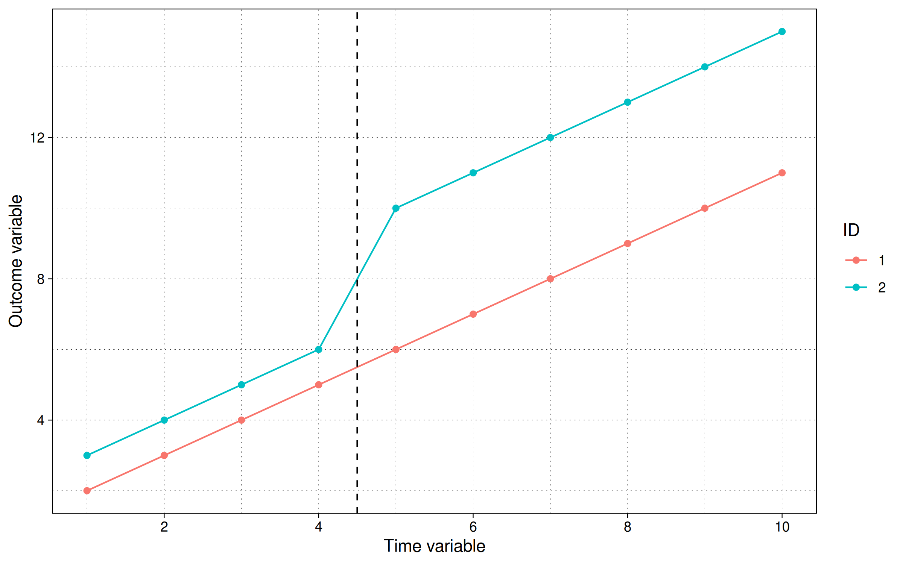
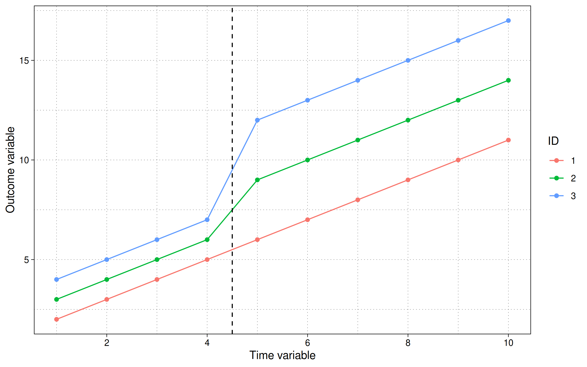

# 双向固定效应(TWFE)模型
{: .no_toc }

## 目录
{: .no_toc .text-delta }

1. TOC
{:toc}

---

## 经典2×2 DiD或双向固定效应模型(TWFE)

让我们从经典的双向固定效应(TWFE)模型开始：

$$ y_{it} = \beta_0 + \beta_1 Treat_i + \beta_2 Post_t + \beta_3 Treat_i Post_t + \epsilon_{it}  $$

上述2×2模型可以用以下表格解释：

|              | 处理 = 0          | 处理 = 1                               | *差异*            |
|--------------|-------------------|----------------------------------------|-------------------|
| **时期 = 0** | $$ \beta_0 $$     | $$ \beta_0 + \beta_1 $$               | $$ \beta_1 $$     |
| **时期 = 1** | $$\beta_0 + \beta_2 $$ | $$ \beta_0 + \beta_1 + \beta_2 + \beta_3 $$ | $$ \beta_1 + \beta_3 $$ |
| 差异         | $$ \beta_2 $$     | $$ \beta_2 + \beta_3 $$               | $$ \beta_3 $$     |

------------------------------------------------------------------------

## 三重差分估计量(DDD)

*未完成*

三重差分估计量本质上是取两个DD，一个是以处理组和对照组为目标分析单位。将其与另一个类似组在预处理和后处理期间进行比较。实际上有两个处理。一个是实际处理，测试期望的组，和一个安慰剂对照组，对其也应用相同的干预。

$$ y_{it} = \beta_0 + \beta_1 P_{i} + \beta_2 C_{j} + \beta_3 T_t + \beta_4 (P_i T_t) + \beta_5 (C_j T_t) + \beta_6 (P_i C_j) + \beta_7 (P_i C_j T_t) + \epsilon_{it} $$

其中我们有3×3组合：$P = {0,1}$，$T={0,1}$，$C={0,1}$。与2×2 DD的情况一样，这里我们感兴趣的系数是$\beta_7$。这也可以用表格形式分解。但与其创建一个
大表，结果通常分别呈现C = 0或主要处理组，和C = 1或主要对照组。两者之间的差异归结为$\beta_7$。让我们在这里看到这一点：

主组(C = 0)：

|            | T = 0                   | T = 1                                       | 差异              |
|------------|-------------------------|---------------------------------------------|-------------------|
| **P = 0**  | $$ \beta_0 $$           | $$ \beta_0 + \beta_3 $$                     | $$ \beta_3 $$     |
| **P = 1**  | $$ \beta_0 + \beta_1 $$ | $$ \beta_0 + \beta_1 + \beta_3 + \beta_4 $$ | $$ \beta_3 + \beta_4 $$ |
| 差异       | $$ \beta_1 $$           | $$ \beta_1 + \beta_4 $$                     | $$ \beta_4 $$     |

对照组(C = 1)：

|            | T = 0                                        | T = 1                                                                               | 差异                                   |
|------------|----------------------------------------------|-------------------------------------------------------------------------------------|----------------------------------------|
| **P = 0**  | $$ \beta_0 + \beta_2 $$                      | $$ \beta_0 + \beta_2 + \beta_3 + \beta_5  $$                                        | $$ \beta_3 + \beta_5 $$                |
| **P = 1**  | $$ \beta_0 + \beta_1 + \beta_2 + \beta_6  $$ | $$ \beta_0 + \beta_1 + \beta_2 + \beta_3 + \beta_4 + \beta_5 + \beta_6 + \beta_7 $$ | $$ \beta_3 + \beta_4 + \beta_5 + \beta_7  $$ |
| 差异       | $$ \beta_1 + \beta_6  $$                     | $$ \beta_1 + \beta_4 + \beta_6 + \beta_7 $$                                         | $$ \beta_4 + \beta_7 $$                |

让我们取两个矩阵的差或
$(C = 1) - (C = 0)$：

|            | T = 0                   | T = 1                                       | 差异              |
|------------|-------------------------|---------------------------------------------|-------------------|
| **P = 0**  | $$ \beta_2  $$          | $$ \beta_2 + \beta_5 $$                     | $$ \beta_5 $$     |
| **P = 1**  | $$ \beta_2 + \beta_6 $$ | $$ \beta_2 + \beta_5 + \beta_6 + \beta_7 $$ | $$ \beta_6 + \beta_7 $$ |
| 差异       | $$ \beta_6 $$           | $$ \beta_6 + \beta_7 $$                     | $$ \beta_7 $$     |

我们最终得到主要差异$$ \beta_7 $$。注意
这个表格逻辑也比有长串的每个组合的期望定义要简单得多。

## 通用TWFE函数形式

如果我们有多个时间段和处理单位，经典2×2
DiD可以扩展到以下通用函数形式：

$$ y_{it} = \alpha_{i} + \alpha_t + \beta^{TWFE} D_{it} + \epsilon_{it} $$

------------------------------------------------------------------------

## R代码

严格来说并不需要——我们可以使用仅基础R来实现
本页上的所有编码示例——但我们将使用**ggplot2**
和**fixest**包来帮助演示一些TWFE的核心原则。

``` r
# install.packages(c("ggplot2", "fixest"))
library(ggplot2)
library(fixest)

# 可选：ggplot2主题
theme_set(
    theme_linedraw() +
    theme(
        panel.grid.minor = element_line(linetype = 3, linewidth = 0.1),
        panel.grid.major = element_line(linetype = 3, linewidth = 0.1)
    )
)
```

让我们在R中生成一个简单的2×2示例。首先定义面板
结构。由于它是2×2，我们只需要两个单位和两个时间
段：

``` r
dat = data.frame(
    id = rep(1L:2L, times = 2),
    tt = rep(1L:2L, each = 2)
)
```

接下来我们定义处理组和通用TWFE模型，而不
添加任何变化或误差项：

``` r
dat = dat |>
    within({
        D     = id == 2 & tt == 2
        btrue = ifelse(D, 2, 0)
        y     = id + 3 * tt + btrue * D
    })

dat
```

      id tt  y btrue     D
    1  1  1  4     0 FALSE
    2  2  1  5     0 FALSE
    3  1  2  7     0 FALSE
    4  2  2 10     2  TRUE

根据最后一行，处理效应应该对后处理组的Y产生3个单位的影响。我们可以通过绘制数据来检查这一点：

``` r
ggplot(dat, aes(x = tt, y = y, col = factor(id))) +
    geom_point() +
    geom_line() +
    geom_vline(xintercept = 1.5, lty = 2) +
    scale_x_continuous(breaks = 1:2, labels = c("预处理", "后处理")) +
    labs(x = "时间变量", y = "结果变量", col = "ID")
```


我们可以看到，蓝线和橙线在后期期间的差异是3个单位，前期是1个单位，净增长为2个单位。这也等于我们指定的处理量。

我们也可以从简单的面板回归中恢复这个结果：

``` r
coef(lm(y ~ D + factor(id) + tt, dat))["DTRUE"]
```

    DTRUE 
        2 

在回归中，你会看到D(=TRUE)的系数，
$\beta^{TWFE} = 2$，如预期。另一种方法是使用`fixest::feols`，我们将在后面的例子中也调用它：

``` r
# library(fixest) ## 已加载

coef(feols(y ~ D | id + tt, dat))
```

    DTRUE 
        2 

这再次为我们提供了`DTRUE`系数的预期结果2。

## 添加更多时间段

现在我们对2×2示例感到满意，让我们添加更多时间
段。每个单位10个如何：

``` r
dat2 = data.frame(
    id = rep(1:2, times = 10),
    tt = rep(1:10, each = 2)
)
```

现在假设在时间期间5对个体2有正处理冲击3个单位，并持续到实验结束。

``` r
dat2 = dat2 |>
    within({
        D     = id == 2 & tt >= 5
        btrue = ifelse(D, 3, 0)
        y     = id + 1 * tt + btrue * D
    })
```

我们也可以如下可视化：

``` r
ggplot(dat2, aes(x = tt, y = y, col = factor(id))) +
    geom_point() +
    geom_line() +
    geom_vline(xintercept = 4.5, lty = 2) +
    scale_x_continuous(breaks = scales::pretty_breaks()) +
    labs(x = "时间变量", y = "结果变量", col = "ID")
```



我们也可以运行TWFE回归：

``` r
# lm(y ~ D + factor(id) + tt, dat2) # 与下面相同的结果
feols(y ~ D | id + tt, dat2)
```

    OLS估计，因变量：y
    观测值：20 
    固定效应：id：2，tt：10
    标准误：按id聚类 
          估计量 标准误差 t值 Pr(>|t|)    
    DTRUE        3    1.4e-15 2.14587e+15 2.9667e-16 ***
    ---
    显著性代码：  0 '***' 0.001 '**' 0.01 '*' 0.05 '.' 0.1 ' ' 1
    RMSE：8.7e-16     调整R2：1
                    组内R2：1

这再次产生了预期的处理效应（这次是：
$\beta^{TWFE} = 3$）。

## 更多单位，相同处理时间，不同处理效应

接下来，让我们考虑一个简单的扩展，我们添加第二个处理
单位（仍然保持单一对照组）。目前我们将指定
两个处理单位同时接受治疗，尽管
处理效应的强度不同。具体来说，我们将假设
id=2有2的处理效应，而id=3有4的处理效应。我们因此提前知道ATT是3
（即个体处理效应的平均值）。这是构造数据集的R代码：

``` r
dat3 = data.frame(
    id = rep(1:3, times = 10),
    tt = rep(1:10, each = 3)
    ) |>
    within({
        D     = id >= 2 & tt >= 5
        btrue = ifelse(D & id == 3, 4, ifelse(D & id == 2, 2, 0))
        y     = id + 1 * tt + btrue * D
    })
```

绘制：

``` r
ggplot(dat3, aes(x = tt, y = y, col = factor(id))) +
    geom_point() +
    geom_line() +
    geom_vline(xintercept = 4.5, lty = 2) +
    scale_x_continuous(breaks = scales::pretty_breaks()) +
    labs(x = "时间变量", y = "结果变量", col = "ID")
```



虽然趋势数据序列使得直接看到有点困难，但我们可以再次转向简单的TWFE回归模型来
确认我们的ATT是$\beta^{TWFE}=3$。

``` r
feols(y ~ D | id + tt, dat3)
```

    OLS估计，因变量：y
    观测值：30 
    固定效应：id：3，tt：10
    标准误：按id聚类 
          估计量 标准误差 t值 Pr(>|t|) 
    DTRUE        3    1.06992 2.80394  0.10714 
    ---
    显著性代码：  0 '***' 0.001 '**' 0.01 '*' 0.05 '.' 0.1 ' ' 1
    RMSE：0.4     调整R2：0.984732
                组内R2：0.75    

值得指出的是，我们的TWFE回归规范满足
这个模拟示例的平行趋势假设。一种使其更明确的方法
是通过估计稍微不同的规范
来删除（包括）不同组合的单位和时间固定
效应。这里我们将使用**fixest**的巧妙
[逐步](https://lrberge.github.io/fixest/reference/stepwise.html)
功能在一次函数调用中估计时间和单位固定效应的所有组合。

``` r
# mvsw产生多宇宙逐步组合
feols(y ~ D | mvsw(tt, id), dat3) |>
    etable(vcov = "iid")
```

                    feols(y ~ D | ..1 feols(y ~ D | ..2 feols(y ~ D |..3
    因变量：                 y                 y                y
                                                                        
    常数        5.833*** (0.5748)                                   
    DTRUE           7.167*** (0.9088) 4.500*** (0.6972) 8.000*** (1.050)
    固定效应：  ----------------- ----------------- ----------------
    tt                             No               Yes               No
    id                             No                No              Yes
    _______________ _________________ _________________ ________________
    标准误类型                     IID               IID              IID
    观测值                   30                30               30
    R2                        0.68954           0.93474          0.75331
    组内R2                      --           0.69828          0.69898

                    feols(y ~ ..4
    因变量：             y
                                 
    常数                     
    DTRUE           3*** (0.4330)
    固定效应：  -------------
    tt                        Yes
    id                        Yes
    _______________ _____________
    标准误类型                 IID
    观测值               30
    R2                    0.99105
    组内R2             0.75000
    ---
    显著性代码：0 '***' 0.001 '**' 0.01 '*' 0.05 '.' 0.1 ' ' 1

上表清楚地表明，只有最终规范（第4列）同时控制单位和时间固定效应，才能得到正确的ATT 3。

## 更多单位，差异处理时间，不同处理效应

最后，让我们考虑当我们引入具有差异时机的处理时，事情如何变化。正如我们将看到的，这是TWFE简单逻辑开始瓦解的地方。

从新的模拟数据集开始，为我们的两个处理单位设置差异时机：

``` r
dat4 = data.frame(
    id = rep(1:3, times = 10),
    tt = rep(1:10, each = 3)
    ) |>
    within({
        D     = (id == 2 & tt >= 5) | (id == 3 & tt >= 8)
        btrue = ifelse(D & id == 3, 4, ifelse(D & id == 2, 2, 0))
        y     = id + 1 * tt + btrue * D
    })
```

以图形形式：

``` r
ggplot(dat4, aes(x = tt, y = y, col = factor(id))) +
    geom_point() +
    geom_line() +
    geom_vline(xintercept = c(4.5, 7.5), lty = 2) +
    scale_x_continuous(breaks = scales::pretty_breaks()) +
    labs(x = "时间变量", y = "结果变量", col = "ID")
```


该图显示组id=2在t=5时接受干预并保持处理，而组id=3在t=8时接受干预并保持处理。那么这里的ATT是什么？

与前面的例子不同，我们可以通过查看图表得出ATT，但在这里并不那么微不足道。交错的处理时机引入了超出简单单位和时间固定效应的新的混杂因素。（注意，即使趋势线不向上倾斜，这也是正确的。）不深入数学，为了恢复实际的ATT，我们需要对处理和非处理观测的时间和面板效应进行平均。我们的TWFE回归给了我们什么？

``` r
feols(y ~ D | tt + id, dat4)
```

    OLS估计，因变量：y
    观测值：30 
    固定效应：tt：10，id：3
    标准误：按tt聚类 
          估计量 标准误差 t值   Pr(>|t|)    
    DTRUE  2.90909   0.270226 10.7654 1.9304e-06 ***
    ---
    显著性代码：  0 '***' 0.001 '**' 0.01 '*' 0.05 '.' 0.1 ' ' 1
    RMSE：0.35505     调整R2：0.986455
                    组内R2：0.831169

在这里，我们获得了系数$\beta^{TWFE} = 2.91$。我们真的
可以称这个估计为ATT吗？让我们想想这个数字代表什么。我们
有两个在不同时间发生的处理，具有不同的处理效应。因此，"预处理"和"后处理"的定义不再清楚。"未处理"与"已处理"也不清楚。如果我们放大区间$5\leq t < 8$，那么只有id=2接受了处理
提升，而其他两个单位以恒定速率继续。但在最后一个区间$t \geq 8$只有id=3正在接受处理效应，而另外两个面板变量在此区间恒定（即使id=2已经被处理！）

完全解开这些组合将需要更仔细的工作，这就是为什么我们推迟到下一节关于[Bacon分解](https://asjadnaqvi.github.io/DiD/docs/code_r/06_bacon_r/)的内容。