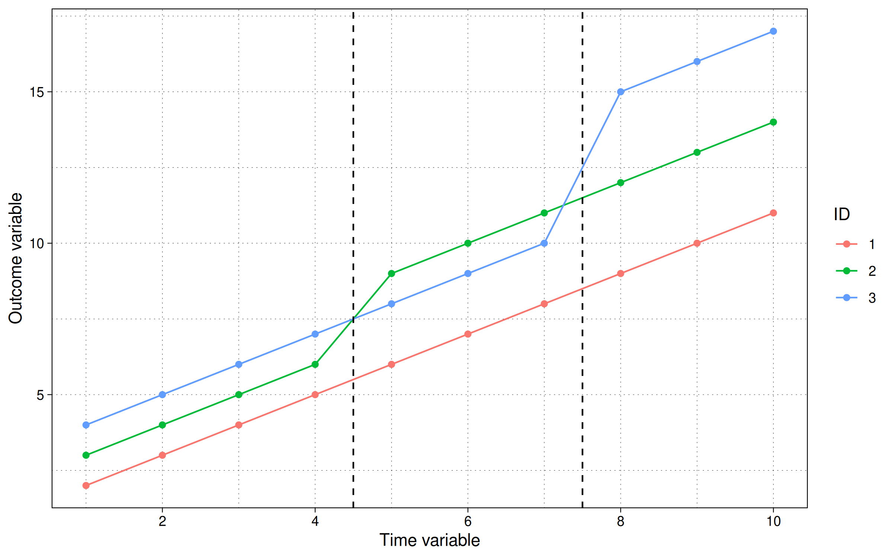
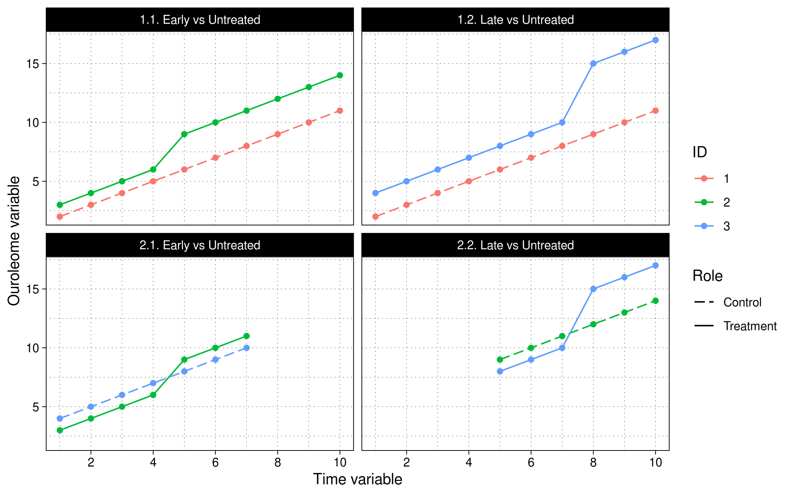
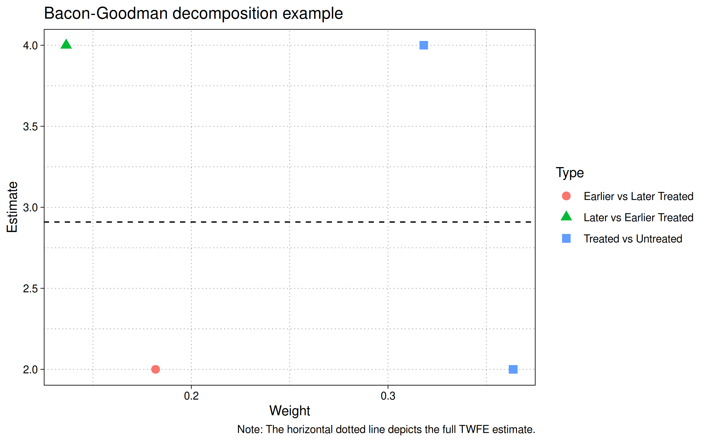

# Goodman-Bacon decomposition
{: .no_toc }

## Table of contents
{: .no_toc .text-delta }

1. TOC
{:toc}

---

This section will walk you through the basic logic of Andrew
Goodman-Bacon’s TWFE decomposition. It draws upon his 2021 *Journal of
Econometrics paper*,  
[Difference-in-differences with variation in treatment
timing](https://www.sciencedirect.com/science/article/pii/S0304407621001445).

We’ll make use of the following R packages.

``` r
# install.packages(c("ggplot2", "fixest", "bacondecomp"))
library(ggplot2)
library(fixest)
library(bacondecomp)

# Optional: custom ggplot2 theme
theme_set(
    theme_linedraw() +
    theme(
        panel.grid.minor = element_line(linetype = 3, linewidth = 0.1),
        panel.grid.major = element_line(linetype = 3, linewidth = 0.1)
    )
)
```

## What is the Goodman-Bacon decomposition?

As discussed at the end of the TWFE section, the introduction of
differential treatment timing makes it hard to draw a bright line
between *pre* and *post* treatment periods. Let’s continue with the same
dataset that we were using in the final example from that section.

``` r
dat4 = data.frame(
    id = rep(1:3, times = 10),
    tt = rep(1:10, each = 3)
    ) |>
    within({
        D = (id == 2 & tt >= 5) | (id == 3 & tt >= 8)
        btrue = ifelse(D & id == 3, 4, ifelse(D & id == 2, 2, 0))
        y = id + 1 * tt + btrue * D
    })
```

In plot form:

``` r
ggplot(dat4, aes(x = tt, y = y, col = factor(id))) +
    geom_point() + geom_line() +
    geom_vline(xintercept = c(4.5, 7.5), lty = 2) +
    scale_x_continuous(breaks = scales::pretty_breaks()) +
    labs(x = "Time variable", y = "Outcome variable", col = "ID")
```



Here we see that our simulation includes two distinct treatment periods.
The first treatment occurs to period 5, where id=2’s trendline jumps by
2 units. The second treatment occurs in period 8, where id=3’s trendline
jumps by 4 units. In contrast, id=1 remains untreated for the duration
of the experiment.

Stepping back, it’s not immediately clear how to calculate the ATT. For
example, how should the late treated unit (id=3) regard the early
treated unit (id=2)? Can the latter be used as control group for the
former? After all, they didn’t receive treatment at the same time… but,
on the other hand, id=2’s path was already altered by the initial
treatment wave.

To unravel this conundrum, let’s start by estimating a simple TWFE
model.

``` r
feols(y ~ D | id + tt, dat4)
```

    OLS estimation, Dep. Var.: y
    Observations: 30 
    Fixed-effects: id: 3,  tt: 10
    Standard-errors: Clustered (id) 
          Estimate Std. Error t value Pr(>|t|)    
    DTRUE  2.90909   0.725719 4.00856 0.056967 .  
    ---
    Signif. codes:  0 '***' 0.001 '**' 0.01 '*' 0.05 '.' 0.1 ' ' 1
    RMSE: 0.35505     Adj. R2: 0.986455
                    Within R2: 0.831169

What does the resulting coefficient estimate of $$\hat{\beta}=2.91$$
represent? The short answer is that it comprises a *weighted average* of
four distinct 2x2 groups (or comparisons):

1.  **treated** vs **untreated**
    1)  *early treated ($$T^e$$)* vs *untreated ($$U$$)*
    2)  *late treated ($$T^l$$)* vs *untreated ($$U$$)*
2.  **differentially treated**
    1)  *early treated ($$T^e$$)* vs *late control ($$C^l$$)*
    2)  *late treated ($$T^l$$)* vs *early control ($$C^e$$)*

We can visualize these four comparison sets as follows:

``` r
rbind(
    dat4 |> subset(id %in% c(1,2)) |> transform(role = ifelse(id==2, "Treatment", "Control"), comp = "1.1. Early vs Untreated"),
    dat4 |> subset(id %in% c(1,3)) |> transform(role = ifelse(id==3, "Treatment", "Control"), comp = "1.2. Late vs Untreated"),
    dat4 |> subset(id %in% c(2,3) & tt<8) |> transform(role = ifelse(id==2, "Treatment", "Control"), comp = "2.1. Early vs Untreated"),
    dat4 |> subset(id %in% c(2:3) & tt>4) |> transform(role = ifelse(id==3, "Treatment", "Control"), comp = "2.2. Late vs Untreated")
) |>
    ggplot(aes(tt, y, group = id, col = factor(id), lty = role)) +
    geom_point() + geom_line() + 
    facet_wrap(~comp) +
    scale_x_continuous(breaks = scales::pretty_breaks()) +
    scale_linetype_manual(values = c("Control" = 5, "Treatment" = 1)) +
    labs(x = "Time variable", y = "Ouroleome variable", col = "ID", lty = "Role")
```



In other words, the panel IDs are split into different timing cohorts
based on when the first treatment takes place and where it lies in
relation to the treatment of other panel IDs. The more panel IDs and
differential treatment timings there are, the more the combinations of
the above groups.

The Goodman-Bacon decomposition isolates each of these 2x2 comparisons
and assigns them a weight, based on their relative coverage in the data
(i.e., how long each comparison lasts relative to the overall timespan,
and how many units were involved).

To implement the Goodman-Bacon decomposition in R, we need simply call
the `bacon()` function from the **bacondecomp** package. An introductory
vignette to package is available
[here](https://cran.r-project.org/web/packages/bacondecomp/vignettes/bacon.html),
although the arguments are pretty self-explanatory. Let’s see what it
yields for our present problem:

``` r
(bgd = bacon(y ~ D, dat4, id_var = "id", time_var = "tt"))
```

      treated untreated estimate    weight                     type
    2       5       Inf        2 0.3636364     Treated vs Untreated
    3       8       Inf        4 0.3181818     Treated vs Untreated
    6       8         5        4 0.1363636 Later vs Earlier Treated
    8       5         8        2 0.1818182 Earlier vs Later Treated

Here we get our weights and the 2x2 $$\beta$$ for each group. The table
tells us that ($$T$$ vs $$U$$), which is the sum of the late and early
treated versus never treated, has the largest weight, followed by early
vs late treated, and lastly, late vs early treated.

Importantly, note that the weighted mean of these estimates is exactly
the same as our earlier (naive) TWFE coefficient estimate. Again, this
shouldn’t be surprising, since the whole point of the Bacon-Goodman
exercise is to decompose the makeup of that estimate and thus highlight
potential sources of bias.

``` r
(bgd_wm = weighted.mean(bgd$estimate, bgd$weight))
```

    [1] 2.909091

We can easily plot this result to visualize how the different components
are affecting the overall estimate.

``` r
ggplot(bgd, aes(x = weight, y = estimate, shape = type, col = type)) +
  geom_hline(yintercept = bgd_wm, lty  = 2) +
  geom_point(size = 3) +
  labs(
    x = "Weight", y = "Estimate", shape = "Type", col = "Type",
    title = "Bacon-Goodman decomposition example",
    caption = "Note: The horizontal dotted line depicts the full TWFE estimate."
    )
```



<!--  -->

The figure shows four points for the four groups in our example.

- *Earlier vs Later Treated* (red circle).
- *Later vs Earlier Treated* (green triangle).
- *Treated vs Untreated* (two blue squares; one for the earlier treated
  group and another for the later treated group).

Finally, Note that the estimate values of 2 and 4 coincide with the
treatment effects that were encoded into our simulation. Specifically,
unit id=2 increases by 2 and unit id=3 increases by 4 over the untreated
unit id=1.

## So where do TWFE regressions go wrong?

*TO BE COMPLETED*
